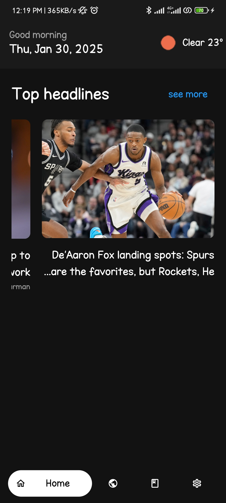
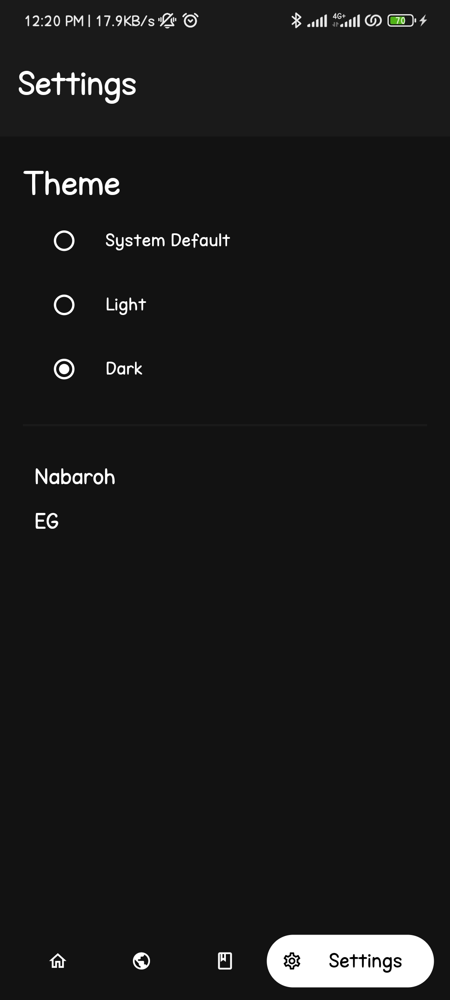
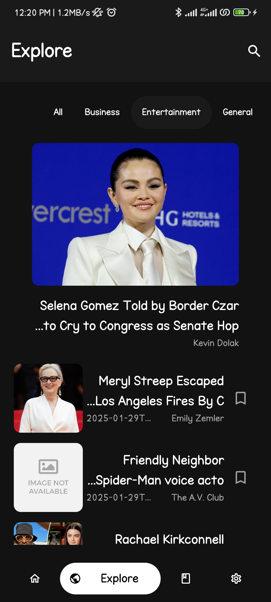

# 📰 Lask

Lask is a sleek and intuitive news application that delivers personalized headlines and updates on global events, technology, entertainment, and more. Stay informed and easily save your favorite articles.

## ✨ Features

- 🌍 **Personalized News Feed** – Receive news tailored to your interests.
- 🌦 **Weather Updates** – Get current weather information based on your location.
- 📰 **Global Coverage** – Access news from around the world.
- 📌 **Save Articles** – Bookmark articles to read later.
- 🎨 **User-Friendly Interface** – Navigate the app with ease.

## 📸 Screenshots

| Home Screen | Article View | Weather Info |
|------------|-------------|-------------|-------------|-------------|
|  |  |  |  |  |

## 🚀 Installation

To run Lask locally, follow these steps:

1. **Clone the repository**:

   ```bash
   git clone https://github.com/Akuma-0/Lask.git
   cd Lask
   ```

2. **Install dependencies**:

   ```bash
   flutter pub get
   ```

3. **Run the app**:

   ```bash
   flutter run
   ```

## 📋 Requirements

- 🔹 **Flutter SDK**
- 🔹 **Dart SDK**

Ensure that both the Flutter and Dart SDKs are installed and properly configured on your system.

## 🤝 Contributing

Contributions are welcome! If you'd like to contribute to Lask, please follow these steps:

1. **Fork the repository**.
2. **Create a new branch**:

   ```bash
   git checkout -b feature/YourFeatureName
   ```

3. **Make your changes**.
4. **Commit your changes**:

   ```bash
   git commit -m 'Add some feature'
   ```

5. **Push to the branch**:

   ```bash
   git push origin feature/YourFeatureName
   ```

6. **Open a Pull Request**.

*For major changes, please open an issue first to discuss what you would like to change.*


---

🎉 *Happy Coding!*
